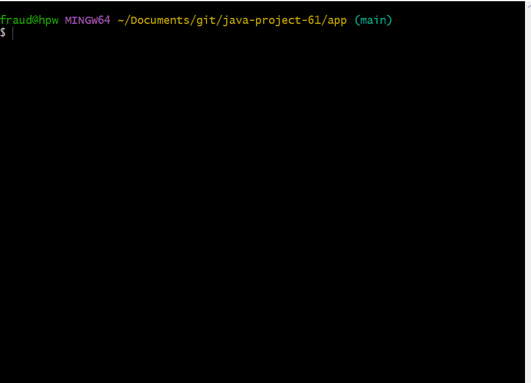
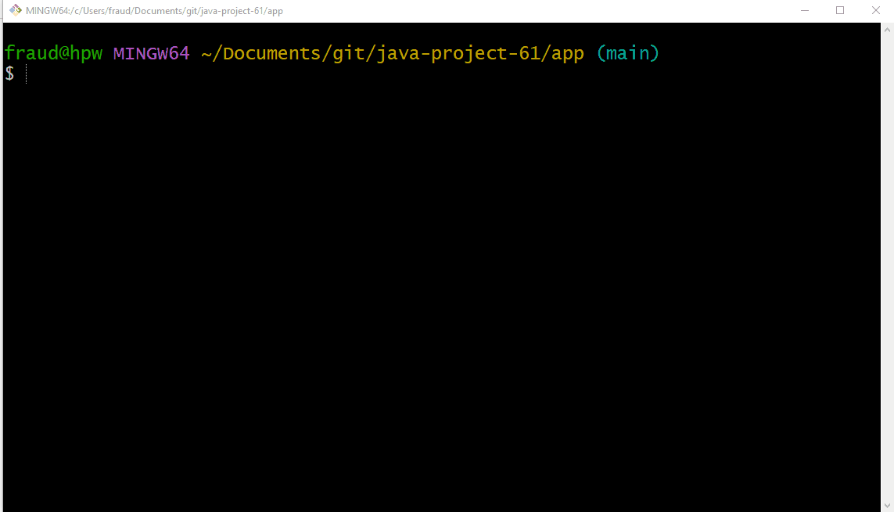
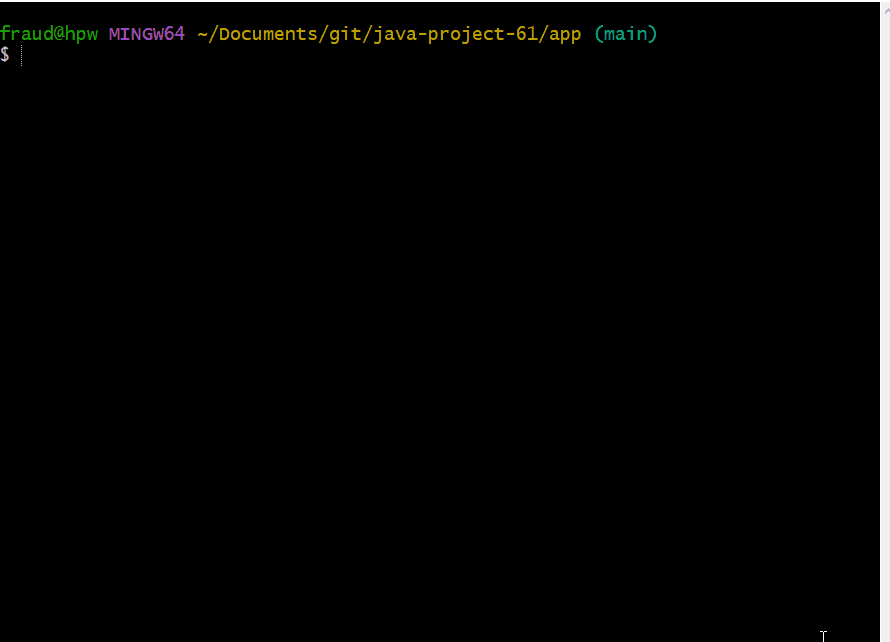

# Hexlet project MindGames
That's advanced lambda-using and avoid duplicate code version. Simple version stores in main branch.

### Hexlet tests and linter status

### Maintainability Badge

Main goal is to create cli-service for solving quite simple issues like define if number is even etc.
You can see the examples below.

### IsEven game demo play

### Calc game demo play

### GCD game demo play

### Progression game demo play

### IsPrime game demo play

### how to run
1. Clone project:
`git clone https://github.com/zheleznikov/java-project-61.git`
2. Run project: `make run` for the first time, and then `make run-dist`
